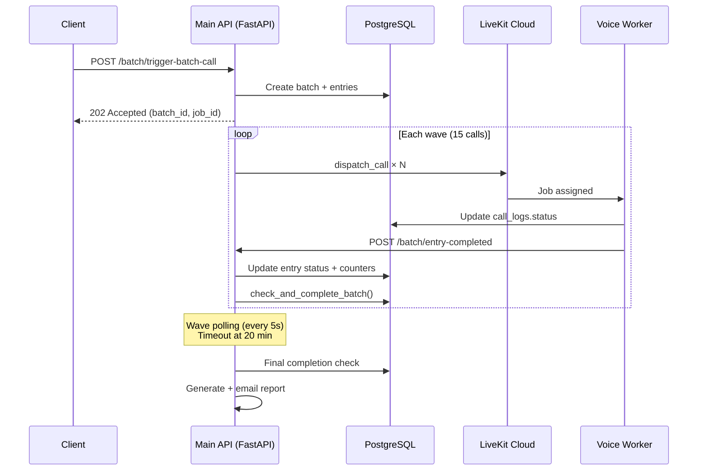
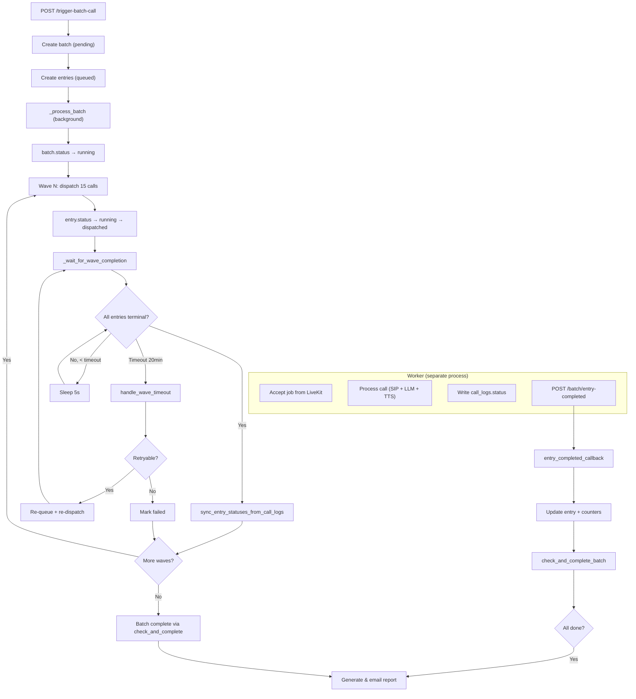

# Batch Call System — Complete Reference

> **Last updated**: 2026-02-19  
> **Source files**: `api/routes/batch.py`, `db/storage/batches.py`, `agent/cleanup_handler.py`

---

## 1. Architecture Overview



### Key Design Decisions

| Decision | Rationale |
|---|---|
| **Worker writes to `call_logs`**, not `batch_entries` | Worker doesn't know about batch entries. `call_logs` is the source of truth for call status |
| **Callback-based completion** | Worker POSTs to `/batch/entry-completed` after call ends. Main API updates `batch_entries` and counters |
| **Report runs in main API** | Worker process terminates after call ends. Main API is a stable process with a long-lived event loop |
| **Wave-based dispatch** | Prevents overwhelming the worker. Waits for each wave to finish before starting the next |

---

## 2. Database Tables

### `lad_dev.voice_call_batches`

The parent batch record.

| Column | Type | Description |
|---|---|---|
| `id` | UUID (PK) | Batch UUID |
| `tenant_id` | UUID (FK) | Tenant owning this batch |
| `status` | TEXT | `pending` → `running` → `completed` / `stopped` / `failed` |
| `total_calls` | INT | Total entries in batch |
| `completed_calls` | INT | Counter incremented by `entry_completed_callback` |
| `failed_calls` | INT | Counter incremented by `entry_completed_callback` or timeout handler |
| `metadata` | JSONB | `{job_id, base_context, llm_provider, llm_model}` |
| `agent_id` | INT | Agent configuration |
| `voice_id` | TEXT | Resolved voice |
| `initiated_by` | UUID (FK → users) | User who triggered the batch |
| `finished_at` | TIMESTAMPTZ | Set when all entries are done |
| `created_at` / `updated_at` | TIMESTAMPTZ | Timestamps |

#### Batch Statuses

| Status | Meaning | Transitions From |
|---|---|---|
| `pending` | Created, not yet dispatching | — |
| `running` | Actively dispatching / waiting for calls | `pending` |
| `completed` | All entries done (terminal) | `running`, `cancelled` |
| `stopped` | User cancelled (calls may still be running) | `running` |
| `failed` | Critical failure (rare) | `running`, `pending` |

---

### `lad_dev.voice_call_batch_entries`

One row per call in the batch.

| Column | Type | Description |
|---|---|---|
| `id` | UUID (PK) | Entry UUID |
| `batch_id` | UUID (FK → batches) | Parent batch |
| `tenant_id` | UUID | Tenant |
| `to_phone` | TEXT | Destination phone number |
| `lead_id` | UUID (FK → leads) | Resolved lead |
| `call_log_id` | UUID (FK → call_logs) | Linked after `dispatch_call` |
| `status` | TEXT | Entry-level status (see below) |
| `last_error` | TEXT | Error message or recovery annotation |
| `retry_count` | INT | Number of times re-queued (default 0) |
| `metadata` | JSONB | `{entry_index, lead_name, added_context}` |
| `created_at` / `updated_at` | TIMESTAMPTZ | Timestamps |

#### Entry Statuses

| Status | Who Sets It | Meaning |
|---|---|---|
| `queued` | `_execute_batch_pipeline`, timeout handler | Waiting to be dispatched (or re-queued for retry) |
| `running` | `_execute_batch_pipeline` | About to call `dispatch_call` |
| `dispatched` | `_execute_batch_pipeline` | `dispatch_call` succeeded, waiting for worker |
| `completed` | `entry_completed_callback`, `sync_entry_statuses_from_call_logs` | Call finished successfully |
| `failed` | `entry_completed_callback`, timeout handler, `sync` | Call failed or timed out |
| `declined` | `sync_entry_statuses_from_call_logs`, timeout recovery | Call not answered / rejected / busy |
| `cancelled` | `cancel_batch`, `sync` | Batch was cancelled before this entry ran |
| `ended` | Legacy / rare — treated same as `completed` | |

---

### `lad_dev.voice_call_logs`

The **source of truth** for call status. Written by the worker during call lifecycle.

| Column | Type | Key Statuses |
|---|---|---|
| `id` | UUID (PK) | Call log UUID |
| `status` | TEXT | See table below |
| `batch_id` | UUID | Links to batch |
| `entry_id` | UUID | Links to batch entry |
| `ended_at` | TIMESTAMPTZ | When call ended |
| `duration_seconds` | INT | Call duration |

#### Call Log Statuses (source of truth)

| Status | Category | Terminal? | Batch Entry Mapping |
|---|---|---|---|
| `in_queue` | Pre-call | ❌ | (pending) |
| `ringing` | Pre-call | ❌ | (pending — failed if stuck) |
| `ongoing` | Active call | ❌ | (pending — failed if too long) |
| `ended` | Success | ✅ | → `completed` |
| `completed` | Success | ✅ | → `completed` |
| `failed` | Failure | ✅ | → `failed` |
| `error` | Failure | ✅ | → `failed` |
| `not_reachable` | Failure | ✅ | → `failed` |
| `declined` | Declined | ✅ | → `declined` |
| `rejected` | Declined | ✅ | → `declined` |
| `no_answer` | Declined | ✅ | → `declined` |
| `busy` | Declined | ✅ | → `declined` |
| `cancelled` | Cancelled | ✅ | → `cancelled` |

---

## 3. Lifecycle — Step by Step

### 3.1 Batch Creation

**Endpoint**: `POST /batch/trigger-batch-call`  
**Handler**: `trigger_batch_call()` → `_execute_batch_pipeline()`

1. Parse request (JSON or CSV with form data)
2. Validate `voice_id`, resolve voice and KB store IDs
3. Resolve `tenant_id` from `initiated_by` user
4. Insert `voice_call_batches` row (status = `pending`)
5. Insert `voice_call_batch_entries` rows (one per phone number)
6. Fire-and-forget `_process_batch()` as background task
7. Return `202 Accepted` with `batch_id` and `job_id`

### 3.2 Wave Dispatch (`_process_batch`)

Runs as `asyncio.create_task` inside the shared `_execute_batch_pipeline`.

```
batch.status → "running"

for each wave of BATCH_WAVE_SIZE entries:
    for each entry in wave:
        entry.status → "running"
        call dispatch_call()
        entry.call_log_id = result.call_log_id
        entry.status → "dispatched"
    
    _wait_for_wave_completion(...)
    
    if batch is stopped → return
```

### 3.3 Wave Polling (`_wait_for_wave_completion`)

Polls every **5 seconds** until all entries reach terminal state or timeout.

```
loop:
    pending = count_pending_entries()   # JOINs call_logs for truth
    
    if pending == 0:
        sync_entry_statuses_from_call_logs()   # Reconcile
        return ✅
    
    if batch is stopped:
        return (cancelled)
    
    if elapsed > BATCH_WAVE_TIMEOUT (20 min):
        handle_wave_timeout()
        if still_ongoing entries exist:
            reset timer, continue waiting
        return timeout_results
    
    sleep(5s)
```

### 3.4 Pending Entry Detection (`count_pending_entries`)

JOINs `batch_entries` with `call_logs` to check the **real** call status:

```sql
SELECT COUNT(*)
FROM batch_entries e
LEFT JOIN call_logs c ON e.call_log_id = c.id
WHERE e.batch_id = ? AND e.id = ANY(?)
  AND (
    -- Has call_log: check call_logs.status (source of truth)
    (c.id IS NOT NULL AND c.status NOT IN (terminal_statuses))
    OR
    -- No call_log: check batch_entries.status
    (c.id IS NULL AND e.status NOT IN (terminal_batch_statuses))
  )
```

> **Why JOIN?** The worker writes status to `call_logs`, not `batch_entries`. Without the JOIN, a completed call would appear "pending" in batch_entries until the callback arrives.

### 3.5 Worker Callback (`entry_completed_callback`)

**Endpoint**: `POST /batch/entry-completed`  
**Called by**: `cleanup_handler.update_batch_on_call_complete()` in worker, with retry (2s, 4s, 8s backoff)

1. Map `call_status` to entry status: `ended/completed` → `completed`, else → `failed`
2. Update `batch_entries.status`
3. Increment `completed_calls` or `failed_calls` counter on batch
4. Call `check_and_complete_batch()`:
   - JOINs `batch_entries` ↔ `call_logs` to count truly-done entries
   - If `done_count >= total_calls` → set `batch.status = 'completed'`, return `should_report = True`
5. If `should_report` → fire-and-forget `_generate_and_send_batch_report()`

### 3.6 Timeout Handling (`handle_wave_timeout`)

Called when `_wait_for_wave_completion` exceeds `BATCH_WAVE_TIMEOUT` (20 min). Handles 5 scenarios:

#### Step 1 — Reset retryable dispatched entries
Entries still in `dispatched` status with `retry_count < MAX_RETRIES (2)` → set to `queued`, increment `retry_count`.

#### Step 2 — Fail max-retry entries
Entries in `dispatched` with `retry_count >= MAX_RETRIES` → set to `failed` with `last_error = 'max_retries_exceeded'`. Also fails the corresponding `call_logs` entry.

#### Step 3 — Check remaining dispatched entries against call_logs
For entries still in `dispatched` after steps 1-2, JOINs `call_logs` to check the real status:

| `call_logs.status` | Action | Result Key |
|---|---|---|
| Terminal success (`ended`, `completed`) | Recover entry to `completed` | `recovered_completed` |
| Terminal failure (`failed`, `error`, `not_reachable`) | Recover entry to `failed` | `recovered_failed` |
| Terminal decline (`declined`, `rejected`, `no_answer`, `busy`) | Recover entry to `declined` | `recovered_failed` |
| `cancelled` | Recover entry to `cancelled` | `recovered_failed` |
| `ringing` | Fail entry + call_log → `failed` | `failed_ringing` |
| `ongoing` (< 15 min) | Keep waiting | `still_ongoing` |
| `ongoing` (≥ 15 min) | Fail entry + call_log → `failed` | `failed_ongoing_stuck` |

### 3.7 Status Sync (`sync_entry_statuses_from_call_logs`)

Called after each wave completes to reconcile `batch_entries.status` from `call_logs.status`. Catches entries where the worker callback never arrived.

```sql
UPDATE batch_entries e
SET status = CASE
    WHEN c.status IN ('ended', 'completed') THEN 'completed'
    WHEN c.status IN ('failed', 'error', 'not_reachable') THEN 'failed'
    WHEN c.status IN ('declined', 'rejected', 'no_answer', 'busy') THEN 'declined'
    WHEN c.status IN ('cancelled', 'canceled') THEN 'cancelled'
    ELSE 'failed'
  END,
  last_error = 'synced_from_call_log:' || c.status
FROM call_logs c
WHERE e.call_log_id = c.id
  AND e.batch_id = ?
  AND e.status NOT IN (terminal_batch_statuses)
  AND c.status IN (terminal_call_statuses)
```

### 3.8 Retry Dispatch

When `handle_wave_timeout` resets entries to `queued`:

1. `_process_batch` fetches queued entries via `get_queued_entries_for_wave()`
2. Re-dispatches them through the same `dispatch_call()` path
3. Waits for the retry wave with `_wait_for_wave_completion()`

### 3.9 Report Generation

Triggered only once by `check_and_complete_batch()` returning `should_report = True`.

```
1. Waits 15 seconds (for final analysis to save to DB)
2. Calls generate_batch_report(batch_id, send_email=True)
3. Generates Excel/PDF report with per-call analysis
4. Emails report to configured recipients
```

### 3.10 Cancellation

**Endpoint**: `POST /batch-cancel/{batch_id}` (deprecated, delegates to `/calls/cancel`)

1. Marks `batch.status = 'stopped'`
2. Marks pending entries as `cancelled`
3. Cancels running entries by deleting LiveKit rooms
4. Between waves, `_process_batch` checks `is_batch_stopped()` and halts

---

## 4. Configuration

All values are configurable via environment variables.

| Variable | Default | Description |
|---|---|---|
| `BATCH_WAVE_SIZE` | `15` | Number of calls dispatched per wave |
| `BATCH_WAVE_POLL_INTERVAL` | `5.0` (seconds) | How often to check for wave completion |
| `BATCH_WAVE_TIMEOUT` | `1200.0` (20 min) | Max wait time per wave before timeout handling |
| `BATCH_MAX_RETRIES` | `2` | Max times a dispatched entry can be re-queued |
| `BATCH_ONGOING_TIMEOUT` | `15` (minutes) | Max time for an "ongoing" call before it's force-failed |
| `MAIN_API_BASE_URL` | `http://localhost:8000` | Worker → Main API callback URL |

---

## 5. Complete Scenario Table

This table covers every possible state combination and the system's response.

### During Wave Polling (every 5s)

| `call_logs.status` | `batch_entries.status` | Situation | Outcome |
|---|---|---|---|
| `ended` | `dispatched` | Call completed, callback pending | `count_pending_entries` → entry is terminal (done) |
| `completed` | `dispatched` | Same as above | Same — terminal |
| `failed` | `dispatched` | Call failed, callback pending | Same — terminal |
| `ongoing` | `dispatched` | Call in progress | `count_pending_entries` → entry is non-terminal (still pending) |
| `ringing` | `dispatched` | Call ringing | Non-terminal (still pending) |
| `in_queue` | `dispatched` | Call not picked up yet | Non-terminal (still pending) |
| (no call_log) | `dispatched` | dispatch_call created room but no call_log link | Non-terminal (still pending) |
| Any | `completed` | Already resolved | Terminal — counted as done |
| Any | `failed` | Already resolved | Terminal — counted as done |
| Any | `cancelled` | Batch was cancelled | Terminal — counted as done |

### When Callback Arrives (`POST /batch/entry-completed`)

| `call_status` (from worker) | Entry Update | Counter Updated |
|---|---|---|
| `ended` | `batch_entries.status → completed` | `completed_calls += 1` |
| `completed` | `batch_entries.status → completed` | `completed_calls += 1` |
| `failed` | `batch_entries.status → failed` | `failed_calls += 1` |
| `declined` | `batch_entries.status → failed` | `failed_calls += 1` |
| `error` | `batch_entries.status → failed` | `failed_calls += 1` |
| Any other | `batch_entries.status → failed` | `failed_calls += 1` |

### On Wave Timeout (after 20 min)

| `call_logs.status` | `batch_entries.status` | `retry_count` | Situation | Action | Result |
|---|---|---|---|---|---|
| Any / None | `dispatched` | < 2 | Request never picked up | Reset to `queued`, increment `retry_count` | **Re-dispatched** in next retry wave |
| Any / None | `dispatched` | ≥ 2 | Max retries exhausted | Set entry → `failed` (`max_retries_exceeded`), set call_log → `failed` | **Failed permanently** |
| `ended` / `completed` | `dispatched` | — | Call finished but callback lost | Recover entry → `completed` | **Recovered as completed** |
| `failed` / `error` / `not_reachable` | `dispatched` | — | Call failed but callback lost | Recover entry → `failed` | **Recovered as failed** |
| `declined` / `rejected` / `no_answer` / `busy` | `dispatched` | — | Call declined but callback lost | Recover entry → `declined` | **Recovered as declined** |
| `cancelled` | `dispatched` | — | Call cancelled but callback lost | Recover entry → `cancelled` | **Recovered as cancelled** |
| `ringing` | `dispatched` | — | Stuck ringing for 20+ min | Set entry → `failed` (`wave_timeout_ringing`), set call_log → `failed` | **Failed (stuck ringing)** |
| `ongoing` | `dispatched` | — | Call active < 15 min | Keep waiting, extend timeout | **Extended wait** |
| `ongoing` | `dispatched` | — | Call active ≥ 15 min | Set entry → `failed` (`ongoing_timeout`), set call_log → `failed` | **Failed (stuck ongoing)** |

### Post-Wave Sync (`sync_entry_statuses_from_call_logs`)

| `call_logs.status` | `batch_entries.status` (before) | Update Applied |
|---|---|---|
| `ended` / `completed` | Any non-terminal | `batch_entries.status → completed`, `last_error = 'synced_from_call_log:ended'` |
| `failed` / `error` / `not_reachable` | Any non-terminal | `batch_entries.status → failed` |
| `declined` / `rejected` / `no_answer` / `busy` | Any non-terminal | `batch_entries.status → declined` |
| `cancelled` / `canceled` | Any non-terminal | `batch_entries.status → cancelled` |
| Default (unknown terminal) | Any non-terminal | `batch_entries.status → failed` |

### Batch Completion Check (`check_and_complete_batch`)

| Condition | `batch.status` before | Action |
|---|---|---|
| `done_count >= total_calls` | `queued` / `running` / `cancelled` | Set `batch.status → completed`, `finished_at = NOW()`, trigger report |
| `done_count >= total_calls` | `completed` | No-op (already completed, no duplicate report) |
| `done_count < total_calls` | Any | No change (batch still in progress) |


---

## 6. Data Flow Summary



---

## 7. Error Recovery Matrix

| Failure Mode | Detection | Recovery |
|---|---|---|
| **Worker crashes mid-call** | `call_logs.status` stays `ongoing`; timeout at 15 min | `handle_wave_timeout` → fail entry + call_log |
| **Callback HTTP fails** | `batch_entries.status` stays `dispatched` while `call_logs` is terminal | `sync_entry_statuses_from_call_logs` reconciles |
| **LiveKit never assigns job** | `call_logs.status` stays `in_queue`; `batch_entries.status = dispatched` | Timeout → reset to `queued` for retry (up to 2x) |
| **Call stuck ringing** | `call_logs.status = ringing` at timeout | `handle_wave_timeout` → fail entry + call_log |
| **Batch cancelled mid-wave** | `is_batch_stopped()` check in polling loop and between waves | Early exit, pending entries → `cancelled` |
| **All retries exhausted** | `retry_count >= MAX_RETRIES` at timeout | `handle_wave_timeout` → fail entry permanently |
| **Report generation fails** | Exception in `_generate_and_send_batch_report` | Logged; can be manually re-triggered |
