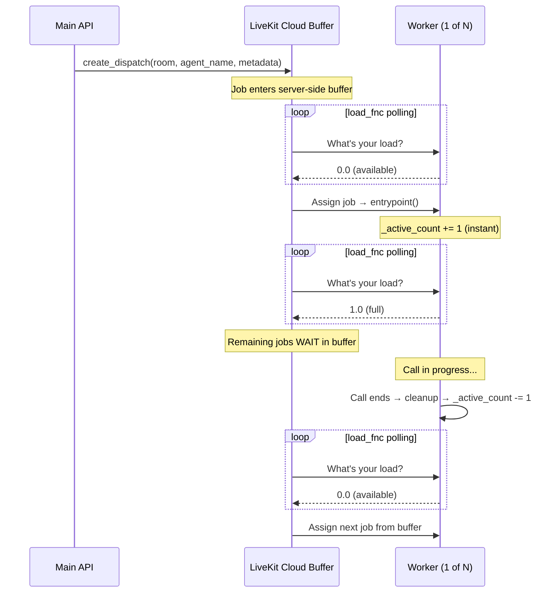

# Dispatch Pipeline — How Calls Reach Workers

> **Last updated**: 2026-02-20
> **Source files**: `api/services/call_service.py`, `agent/worker.py`, `agent/cleanup_handler.py`
> **Related docs**: [BATCH_LOGIC.md](BATCH_LOGIC.md), [CANCEL_API.md](CANCEL_API.md)

---

## 1. Overview

Every outbound call — single or batch — follows the same path:

```
API Server ──create_dispatch()──► LiveKit Cloud Buffer ──assigns──► Worker entrypoint
```

LiveKit Cloud holds a **server-side dispatch queue** (the "buffer"). Workers don't pull jobs — LiveKit pushes them based on each worker's reported load.



---

## 2. Single Call vs Batch — Dispatch Differences

### Single Call

A single `POST /calls/start-call` creates **one room** and **one dispatch**:

```
API → create_room() → create_dispatch() → done
           │
           └── 1 job enters LiveKit buffer → assigned to first available worker
```

- No wave logic, no polling, no retry
- Worker processes the call, runs cleanup, done
- Cancellation: `POST /calls/cancel` with `resource_id = call_log_id` (see [CANCEL_API.md](CANCEL_API.md))

### Batch Call

A batch `POST /batch/trigger-batch-call` creates 12+ rooms in rapid succession:

```
API → for each entry in wave:
        create_room() → create_dispatch()
           │
           └── 12 jobs enter LiveKit buffer simultaneously
```

- All 12 dispatches sit in the LiveKit Cloud buffer
- Workers pick them up **one at a time** based on available capacity
- No time wasted between calls — as soon as a worker finishes one, the next job is assigned immediately from the buffer
- The buffer has a **TTL** — jobs expire if no worker picks them up in time (handled by wave timeout logic, see [BATCH_LOGIC.md § 3.6](BATCH_LOGIC.md))

> [!IMPORTANT]
> The buffer is a key design choice. Creating all 12 dispatches upfront means workers have **zero idle time** between calls. The alternative — dispatching one at a time from main.py — would add API round-trip latency between every call.

---

## 3. Worker Concurrency Control

Workers have a concurrency limit (default `MAX_CONCURRENT_CALLS=1`) enforced by two mechanisms working together:

### Layer 1: Atomic Counter → `load_fnc`

```python
_active_count = 0          # Incremented IMMEDIATELY on job entry
_count_lock = threading.Lock()

def calculate_worker_load(worker) -> float:
    with _count_lock:
        count = _active_count
    return min(count / _MAX_CONCURRENT_CALLS, 1.0)
```

LiveKit polls `load_fnc` to decide whether to assign more jobs. When `load >= load_threshold` (set to `1.0`), the worker is marked **full** and no more jobs are dispatched to it.

The counter increments **before any async work** in the entrypoint:

```python
async def entrypoint(ctx):
    with _count_lock:
        _active_count += 1  # ← Instant, before semaphore or DB calls
```

This ensures that even if LiveKit polls twice in 10ms, the second poll sees `load=1.0`.

### Layer 2: Semaphore (Safety Net)

```python
_call_semaphore = asyncio.Semaphore(_MAX_CONCURRENT_CALLS)
```

The semaphore is acquired immediately after the counter. In the (extremely rare) case where two jobs slip through the load_fnc timing window, the semaphore queues the second one instead of running two calls simultaneously.

### Combined Entry Flow

```
Job dispatched by LiveKit
              │
              ▼
    ┌─────────────────────┐
    │ _active_count += 1  │  ← Instant (threading.Lock)
    │ load_fnc → 1.0      │  ← LiveKit stops sending jobs
    └─────────────────────┘
              │
              ▼
    ┌─────────────────────┐
    │ semaphore.acquire()  │  ← Safety net (should never block)
    └─────────────────────┘
              │
              ▼
    ┌─────────────────────┐
    │ Parse metadata       │
    │ Connect to room      │
    │ Process call         │
    └─────────────────────┘
```

### With Multiple Workers (e.g. 3 workers, concurrency=1 each)

```
LiveKit Buffer: [job1, job2, job3, job4, ..., job12]
                  │      │      │
                  ▼      ▼      ▼
              Worker1  Worker2  Worker3     ← each reports load=1.0 after taking 1 job
                                           ← jobs 4-12 wait in buffer
              
Worker1 finishes → load=0.0 → gets job4
Worker3 finishes → load=0.0 → gets job5
...
```

Each worker independently manages its own `_active_count`. LiveKit distributes jobs across all workers that report `load < load_threshold`.

---

## 4. Call Lifecycle in the Worker

```mermaid
flowchart TD
    A["entrypoint(ctx)"] --> B["_active_count += 1"]
    B --> C["semaphore.acquire()"]
    C --> D{"Batch call?"}
    
    D -->|Yes| E{"Batch cancelled?"}
    E -->|Yes| F["Update status → cancelled<br>semaphore.release()<br>_active_count -= 1<br>ctx.shutdown()"]
    E -->|No| G["ctx.connect()"]
    
    D -->|No| G
    
    G --> H["Load agent config"]
    H --> I["Build TTS/LLM/STT"]
    I --> J["Create AgentSession"]
    J --> K{"Outbound?"}
    
    K -->|Yes| L["SIP dial out<br>status → ringing → ongoing"]
    K -->|No (Inbound)| M["status → ongoing"]
    
    L --> N["Call in progress"]
    M --> N
    
    N --> O["Call ends<br>shutdown_callback()"]
    O --> P["cleanup_and_save()"]
    P --> Q["finally block:<br>semaphore.release()<br>_active_count -= 1"]
    
    Q --> R["Worker available<br>load_fnc → 0.0<br>LiveKit assigns next job"]
    
    style F fill:#f96,stroke:#333
    style R fill:#6f9,stroke:#333
```

### Batch-Specific: Early Cancellation Check

Before connecting to the room, batch calls check if the batch has been cancelled:

```python
if batch_id and call_log_id:
    is_cancelled = await batch_storage.is_batch_stopped(batch_id)
    if is_cancelled:
        # Don't connect — release slot immediately
        _call_semaphore.release()
        _active_count -= 1
        ctx.shutdown()
        return
```

This handles the case where all 12 calls were dispatched to the buffer, and then the user cancelled the batch via `POST /calls/cancel` (see [CANCEL_API.md](CANCEL_API.md)). The worker checks DB before making the actual SIP call, saving telephony costs.

---

## 5. Cleanup and Slot Release

When a call ends (participant disconnects, silence timeout, or room deleted), the shutdown callback runs:

```
shutdown_callback()
    ├── Stop background audio
    ├── cleanup_and_save()
    │   ├── Stop recording → upload to GCS
    │   ├── Save transcription
    │   ├── Update call_logs.status → ended
    │   ├── Calculate usage costs
    │   ├── POST /batch/entry-completed (if batch call)
    │   └── Trigger analysis
    └── finally block
        ├── _call_semaphore.release()
        └── _active_count -= 1   ← Worker reports load=0.0 → gets next job
```

> [!IMPORTANT]
> The `finally` block guarantees the slot is **always** released, even if `cleanup_and_save()` throws an exception. This prevents a crashed call from permanently blocking the worker.

The counter decrement and semaphore release happen **together** in the `finally` block, ensuring the worker is atomically marked as available.

---

## 6. The Buffer — What Happens to Waiting Jobs

| Scenario | What Happens |
|---|---|
| Worker available | Job assigned immediately (< 150ms) |
| Worker full (`load=1.0`) | Job stays in buffer, waiting |
| Worker finishes a call | `load_fnc` → 0.0, next job assigned from buffer |
| Worker crashes | Job stays in buffer until timeout (see [BATCH_LOGIC.md § 3.6](BATCH_LOGIC.md)) |
| Batch cancelled | Worker checks DB at entry, skips cancelled calls (§ 4 above) |
| No workers registered | Job eventually fails (no agent available error) |
| Buffer TTL expires | Job dropped — wave timeout handler retries it (see [BATCH_LOGIC.md § 3.6](BATCH_LOGIC.md)) |

### Why We Don't Reject Jobs

LiveKit's `request_fnc` allows workers to reject jobs. **We don't use this** because:

1. Rejected jobs are re-dispatched to "the next available worker"
2. With only 1 worker, there IS no next worker — the job is **dropped**
3. Dropped jobs break the batch buffer pattern

Instead, we use `load_fnc` to tell LiveKit "I'm full" — remaining jobs stay safely in the buffer.

---

## 7. Configuration

| Variable | Default | Description |
|---|---|---|
| `MAX_CONCURRENT_CALLS` | `1` | Max simultaneous calls per worker |
| `VOICE_AGENT_NAME` | `inbound-agent` | Worker name for dispatch targeting |
| `BATCH_WAVE_SIZE` | `15` | Calls per batch wave (buffer size) |

### Scaling Examples

| Workers | `MAX_CONCURRENT_CALLS` | Effective Capacity | Buffer Behavior |
|---|---|---|---|
| 1 | 1 | 1 call at a time | 11 of 12 wait in buffer |
| 3 | 1 | 3 calls at a time | 9 of 12 wait in buffer |
| 1 | 3 | 3 calls at a time | 9 of 12 wait in buffer |
| 3 | 3 | 9 calls at a time | 3 of 12 wait in buffer |

---

## 8. Concurrency Bug Fix (2026-02-20)

### The Problem

LiveKit dispatches jobs faster than `worker.active_jobs` updates. During burst dispatch, `load_fnc` returned `0.0` for all jobs, causing the worker to accept 3-4 jobs when its limit was 1.

### The Fix

Replaced `len(worker.active_jobs)` with `_active_count` — a `threading.Lock`-protected counter that increments **immediately** when the entrypoint starts, before any async work. This closes the race window from ~50ms to effectively 0.

```diff
  def calculate_worker_load(worker):
-     active_jobs = len(worker.active_jobs)
-     return active_jobs / _MAX_CONCURRENT_CALLS
+     with _count_lock:
+         count = _active_count
+     return min(count / _MAX_CONCURRENT_CALLS, 1.0)
```

The semaphore remains as a safety net for the (theoretically possible) sub-millisecond race condition.
